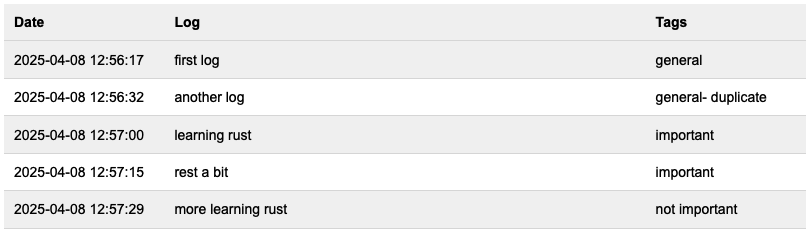

# Random stuff with rust
* Some random projects I've developed to learn rust.
* I tried to keep each project in one file, small but functional.
* Obviously I'm new to rust and these are not written with the best possible rust codes.

List of stuff that are here:
* [tic-tac-toe game](#tic-tac-toe-game).
* mp3 tag editor.
* Networking (this is wip still).
* Some data structures.
    Somehow I implemented something like linked-list, but not sure if it's the best implementation.
* [Qulog](#qulog) A quick log persister with sqlite.

## Notable stuff so far ...
### Tic-Tac-Toe Game
This is a small, in terminal game, that works like this:
```
*** NEW GAME ***
Enter a mark,
for quiting enter quit,
for restarting enter restart.
                
-       -       -
-       -       -
-       -       -
Player X Enter the input! (format: xy, like: 21)
11
X       -       -
-       -       -
-       -       -

//....

Player O Enter the input! (format: xy, like: 21)
23
X       X       -
O       O       O
X       -       -
----------------------------
>>> PLAYER O WON THE GAME! <<<
----------------------------
```
### QuLog
#### Create Logs
```
Usage: rand_sht log [OPTIONS] <TEXT>

Arguments:
  <TEXT>  

Options:
  -t, --tags <TAGS>  
  -h, --help         Print help
```
Example: 
```
cargo run log "today log" --tags="tag1,tag2"
```

#### Show Logs
```
Usage: rand_sht show [OPTIONS] [DATE_RANGE]

Arguments:
  [DATE_RANGE]  [possible values: today, this-week, this-month, this-year]

Options:
      --tags <TAGS>              
  -s, --start-date <START_DATE>  
  -e, --end-date <END_DATE>      
  -h, --help                     Print help
```
Example of output:
```
-> 2025-04-02 20:08:24 : sample log [tag1-tag2]
-> 2025-04-02 20:08:33 : another sample log 
 //...
```

#### Export Logs
It's possible to export logs in a HTML table format.
`resources/table-css.css` can also be edited to have custom css for the table.
```
Usage: rand_sht export [OPTIONS] [DATE_RANGE]

Arguments:
  [DATE_RANGE]  [possible values: today, this-week, this-month, this-year]

Options:
      --tags <TAGS>              
  -s, --start-date <START_DATE>  
  -e, --end-date <END_DATE>      
      --to <TO>                  
  -h, --help                     Print help
```
Example:
```
cargo run export --to ~/Desktop this-month
```
